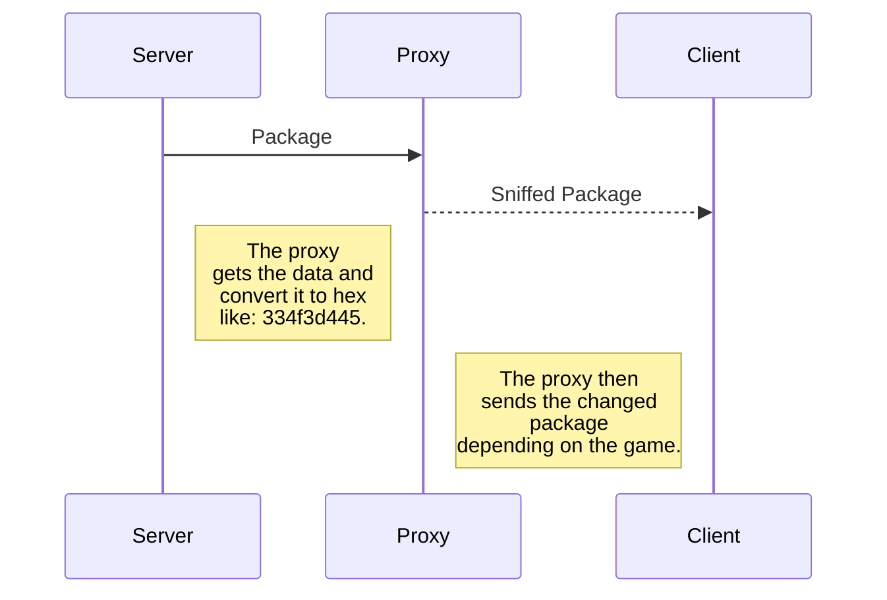

# Python Proxy Server
> a proxy server for capture packages between client and server, good for games but you can use for any application

# How It Works

## How to use: 
use the script uses argv so you need to specify the game server.

_runing the program:_ `python3 proxy.py {your ip} {your port} --game {server ip} {server port}`

## parser_filter.py
> This module is a filter, and used for treatment of the data passed.
